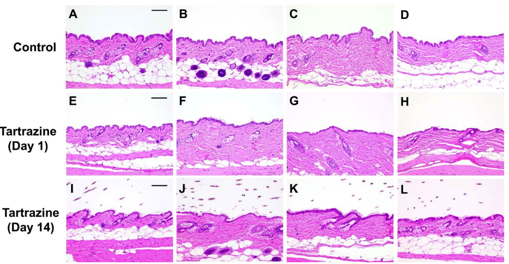

# Tartrazine-Induced Skin Transparency in Mice

[Link to MY Relevant Presentation](https://www.figma.com/deck/CvLVfrjM53WDm3f0cAvqaa)

This repository contains a research study examining the effects of tartrazine, a common yellow food dye, on the transparency of mouse skin. The study explores the potential applications of this phenomenon in non-invasive imaging and its implications for biomedical research and clinical practice.

## Project Overview

Recent research has demonstrated that tartrazine can temporarily render mouse skin transparent when applied topically. This discovery opens new doors for non-invasive imaging techniques in biological systems and has potential applications in fields like neurology, oncology, and developmental biology.

### Key Findings:
- Tartrazine can make living mouse skin transparent within minutes.
- The transparency allows direct visualization of internal structures like blood vessels and muscles.
- The effect is reversible, and no significant health impacts were found in short-term studies.

## Images

### Histology of Tartrazine-Treated and Control Samples
This image shows a comparison of histological sections between control and tartrazine-treated mice at various time points.

### Body Weight Change After Tartrazine Application
This graph shows that there were no significant differences in body weight between control and tartrazine-treated mice over a 30-day period.

### Light Absorption by Tartrazine
This graph shows the absorption spectrum of tartrazine at different concentrations.

### Application of Tartrazine Over Time
Laser speckle contrast images show the skin transparency achieved after applying tartrazine and massaging the skin over a 10-minute period.

### Comparison Between Tartrazine and Glycerol for Skin Clearing
This figure compares the light transmission and scattering effects of tartrazine and glycerol on skin tissue at various thickness levels.

### Blood Count Analysis
No significant differences were found in blood count parameters between control and tartrazine-treated mice.

## Methodology
1. **Tartrazine Application**: Mice were treated with a solution of tartrazine on various parts of the body, including the scalp, abdomen, and hindlimb.
2. **Imaging**: Time-lapse laser speckle contrast imaging was used to visualize the transparency of the tissue over time.
3. **Histology**: Samples were collected for histological analysis to assess tissue changes.
4. **Safety Assessment**: Mice were monitored for body weight changes and blood counts to evaluate the potential side effects of tartrazine treatment.

## Conclusion
Tartrazine-induced transparency in living tissues presents a promising approach for non-invasive imaging. Future work will focus on optimizing this technique for human application and exploring its use in clinical diagnostics and adaptive sports.

## How to Use the Repository
- Download or clone the repository to access the full dataset and analysis.
- The images provided give a visual understanding of the key findings of the study.
- Additional details are available in the attached [research report](Report.pdf).

## References
- Ou et al., "Achieving optical transparency in live animals with absorbing molecules", Science, 2024.
- Miller, "To turn tissue transparent, dye it yellow", 2024.

## License
This project is licensed under the MIT License.
